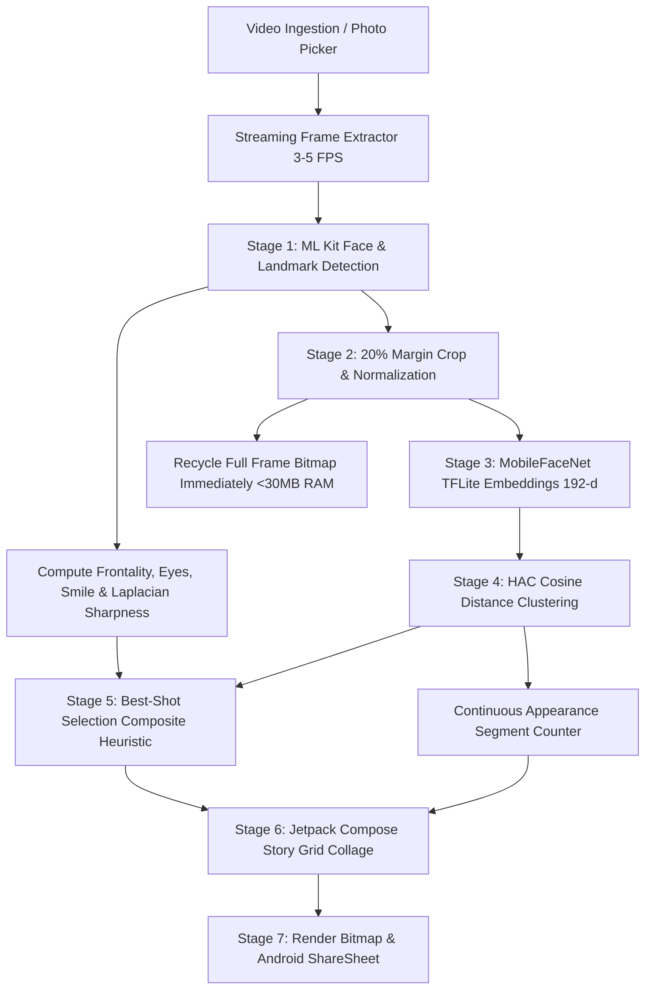

# IYKYK: Video-Based Unique-Person Story Collage App (Android)

An on-device Android application (**Kotlin + Jetpack Compose**) that processes portrait video clips, detects faces and landmarks using **Google ML Kit**, generates normalized identity embeddings using an embedded **MobileFaceNet TFLite** model, clusters faces to isolate unique individuals and continuous appearance segments, selects the best representative high-quality shot for each person, and composes an aesthetic, shareable Instagram-Story / Bento-Grid style collage.

---

## Architecture & Pipeline Flow

---

## Core Pipeline Stages & Mathematical Formulations

### 1. Low-Memory Streaming Video Ingestion
- **Sampling Strategy**: Decodes frames at $3 \text{–} 5\text{ FPS}$ ($\sim 200\text{–}300\text{ms}$ intervals) via `MediaMetadataRetriever` on background coroutines (`Dispatchers.Default`).
- **Memory Optimization**: Rather than accumulating full video frames in memory (~1 GB RAM for 30s video), the pipeline operates as a **streaming pipeline**:
  1. Decodes frame $i$.
  2. Runs ML Kit face detection and Laplacian sharpness.
  3. Extracts face crops and runs MobileFaceNet embeddings.
  4. Generates a compact portrait bust thumbnail ($\sim 50\text{KB}$) for collage rendering.
  5. **Immediately recycles the full frame bitmap** (`frameBitmap.recycle()`).
  6. Keeps peak memory footprint strictly under **$< 30\text{MB}$**, preventing OOM crashes on long or 4K videos.

### 2. ML Kit Face Detection & Quality Metrics
- **Engine**: Google ML Kit `FaceDetection.getClient(FaceDetectorOptions)`:
  - `PERFORMANCE_MODE_ACCURATE`
  - `LANDMARK_MODE_ALL`
  - `CLASSIFICATION_MODE_ALL` (eye open probabilities, smile probability)
  - `CONTOUR_MODE_NONE`
- **Frontality Scoring**:
  $$S_{\text{front}} = \left(1.0 - \frac{|\text{EulerY}| + |\text{EulerZ}| + 0.5 \cdot |\text{EulerX}|}{90.0}\right) \in [0.0, 1.0]$$
- **Laplacian Variance Sharpness**:
  Computed on grayscale face crops using a $3 \times 3$ discrete Laplacian operator:
  $$\begin{bmatrix} 0 & 1 & 0 \\ 1 & -4 & 1 \\ 0 & 1 & 0 \end{bmatrix}$$
  Higher statistical variance of the gradient response indicates in-focus, crisp facial details.

### 3. Face Embeddings (MobileFaceNet TFLite)
- **Model**: Authentic pre-trained **MobileFaceNet** ($112 \times 112$ RGB input, 192-dimensional output embedding) bundled directly in `app/src/main/assets/models/mobilefacenet.tflite` (~5.2MB).
- **Inference**:
  - Crops face with a 20% margin to preserve contour and ear features.
  - Normalizes RGB pixel values to $[-1.0, 1.0]$: $\frac{\text{pixel} - 127.5}{128.0}$.
  - Fails loudly with descriptive error messages if model initialization fails.
- **$L_2$ Normalization**:
  $$\hat{v} = \frac{v}{\|v\|_2} = \frac{v}{\sqrt{\sum_{i=1}^{192} v_i^2}}$$

### 4. Identity Clustering & Appearance Counting
- **Cosine Distance Metric**:
  $$D_{\text{cos}}(u, v) = 1.0 - \frac{u \cdot v}{\|u\|_2 \|v\|_2} \le 0.35$$
- **Clustering Algorithm**: Hierarchical Agglomerative Clustering (HAC) with centroid re-estimation and average linkage to group detections into discrete unique identities.
- **Appearance Segmentation Rule**: A continuous appearance segment ends whenever an identity is absent/occluded for $> T_{\text{break}}$ ($1.2\text{ seconds}$).

### 5. Best Shot Selection (Composite Quality Heuristic)
Evaluates candidate detections per identity cluster to select the single best representative portrait:
$$\text{Score} = w_{\text{sharp}} \cdot S_{\text{sharp}} + w_{\text{front}} \cdot S_{\text{front}} + w_{\text{eyes}} \cdot S_{\text{eyes}} + w_{\text{smile}} \cdot S_{\text{smile}} - \text{Penalty}_{\text{clipped}}$$
- $w_{\text{sharpness}} = 0.35, \quad w_{\text{front}} = 0.25, \quad w_{\text{eyes}} = 0.25, \quad w_{\text{smile}} = 0.15, \quad \text{Penalty}_{\text{clipped}} = 0.35$
- **Generous Bust Cropping**: Generates generous $4:5$ portrait crops (expanding coordinates by 50% downward for shoulders/neck and upward for hair).

### 6. Minimalist UI & Story Export
- **100% Jetpack Compose**: High-contrast monochrome black & white design.
- **Permissionless System Picker**: Uses `ActivityResultContracts.PickVisualMedia()` for zero-storage-permission privacy.
- **Instagram Story Collage**: Generates $1080 \times 1920$ Story layout with adaptive bento grids, customizable title, appearance badges, and direct Android ShareSheet integration.

---

## Unit Testing

- [`IdentityClusteringEngineTest.kt`](app/src/test/java/com/example/iykyk/IdentityClusteringEngineTest.kt): Unit tests cosine similarity, distance metrics, IoU calculations, and validates that agglomerative clustering math and appearance segment algorithms correctly partition synthetic multi-appearance test sequences.
- [`BestShotSelectorTest.kt`](app/src/test/java/com/example/iykyk/BestShotSelectorTest.kt): Unit tests frontality scoring, boundary clipping penalties, and verifies that the composite quality heuristic selects sharp, smiling, front-facing frames over blurry frames.

---

## Build & Run Requirements

- **Android Studio**: Koala / Ladybug or newer
- **JDK**: Java 17+
- **Android SDK**: `compileSdk = 34`, `minSdk = 26`, `targetSdk = 34`
- **TFLite Model**: Bundled in `app/src/main/assets/models/mobilefacenet.tflite`