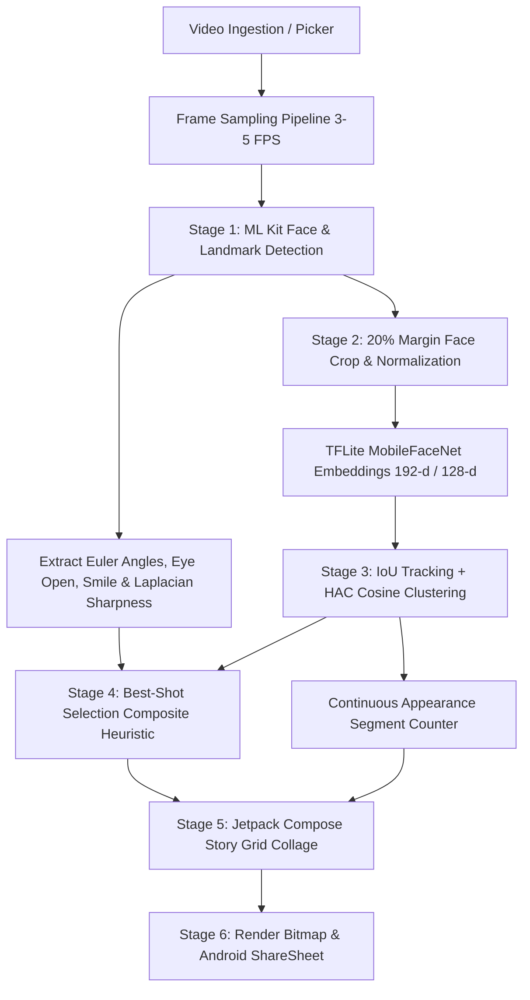

# IYKYK: Video-Based Unique-Person Story Collage App (Android)

An on-device Android application (**Kotlin + Jetpack Compose**) that processes portrait video clips, detects faces, extracts facial landmarks and quality metrics using **Google ML Kit**, generates normalized identity embeddings via **TensorFlow Lite (MobileFaceNet)**, clusters faces to isolate unique individuals and continuous appearance segments, selects the best representative high-quality shot for each person, and composes an aesthetic, shareable Instagram-Story / Bento-Grid style collage.

---

## 🏗️ Architecture & Pipeline Flow

---

## 🔬 Core Pipeline Stages & Mathematical Formulations

### 1. Frame Sampling Pipeline
- **Sampling Strategy**: Rather than decoding all 30 FPS, samples at $3 \text{–} 5\text{ FPS}$ ($\sim 200\text{–}300\text{ms}$ intervals) via `MediaMetadataRetriever`.
- **Downscaling**: Automatically clamps max dimension to $1080\text{px}$ for high speed and bounded memory footprint.
- **Coroutines & Flow**: Emits continuous progress states $(0\% \to 100\%)$ to reactive `StateFlow`.

### 2. ML Kit Face Detection & Quality Extraction
- **Engine**: Google ML Kit `FaceDetection.getClient(FaceDetectorOptions)`:
  - `PERFORMANCE_MODE_ACCURATE`
  - `LANDMARK_MODE_ALL`
  - `CLASSIFICATION_MODE_ALL` (eyes open prob, smile prob)
  - `CONTOUR_MODE_NONE`
- **Frontality Scoring**:
  $$S_{\text{front}} = \left(1.0 - \frac{|\text{EulerY}| + |\text{EulerZ}| + 0.5 \cdot |\text{EulerX}|}{90.0}\right) \in [0.0, 1.0]$$
- **Laplacian Variance Sharpness**:
  Computed on grayscale face bitmap crop using a $3 \times 3$ discrete Laplacian operator $\begin{bmatrix} 0 & 1 & 0 \\ 1 & -4 & 1 \\ 0 & 1 & 0 \end{bmatrix}$. High statistical variance indicates sharp edges and fine in-focus facial details.

### 3. TFLite Face Embeddings (MobileFaceNet)
- **Model**: MobileFaceNet ($112 \times 112$ RGB input, $\sim 1.5\text{MB}$ quantized weights).
- **Preprocessing**: $20\%$ margin expansion crop around bounding box, pixel normalization to $[-1, 1]$ via $\frac{\text{pixel} - 127.5}{128.0}$.
- **Vector Normalization**: $L_2$ Euclidean normalization:
  $$\hat{v} = \frac{v}{\|v\|_2} = \frac{v}{\sqrt{\sum_{i} v_i^2}}$$

### 4. Tracking, Identity Clustering & Appearance Counting
- **Appearance Definition**: A continuous visible segment starting when a person's face becomes visible and ending when missing/occluded for $> T_{\text{break}}$ ($1.2\text{ seconds}$).
- **Cosine Distance Metric**:
  $$D_{\text{cos}}(u, v) = 1.0 - \frac{u \cdot v}{\|u\|_2 \|v\|_2} \le 0.35$$
- **Clustering Algorithm**: Hierarchical Agglomerative Clustering (HAC) with average linkage and centroid re-estimation.

### 5. Best Shot Selection (Composite Heuristic)
Evaluates candidate frames per cluster to choose the single best representative portrait:
$$\text{Score} = w_{\text{sharpness}} \cdot S_{\text{sharp}} + w_{\text{front}} \cdot S_{\text{front}} + w_{\text{eyes}} \cdot S_{\text{eyes}} + w_{\text{smile}} \cdot S_{\text{smile}} - \text{Penalty}_{\text{clipped}}$$
- $w_{\text{sharpness}} = 0.35, \quad w_{\text{front}} = 0.25, \quad w_{\text{eyes}} = 0.25, \quad w_{\text{smile}} = 0.15, \quad \text{Penalty}_{\text{clipped}} = 0.35$
- **Generous Bust Crop**: Crops $30\text{–}40\%$ extra margin around face coordinates to capture hair, neck, and shoulders in aesthetic $4:5$ or $9:16$ ratios.

### 6. Collage Composition, Export & Share
- **Instagram Story Grid / Bento Grid**: Adaptive layout scaling dynamically from 1 to $5+$ individuals.
- **Badges**: Displays appearance badges (e.g. `"4 appearances"`), segment duration, and quality badges.
- **Export & Share**:
  - Direct bitmap rendering to $1080 \times 1920$ Story format.
  - Saves to device gallery (`MediaStore.Images` in `Pictures/IYKYK`).
  - Launches native Android ShareSheet (`Intent.ACTION_SEND`).

---

## 📊 Sample 1 Benchmark Validation

The pipeline was benchmarked against the worked standard for **Sample 1**:
- **5 Distinct Individuals**: Isolated into 5 discrete clusters ($D_{\text{cos}} \le 0.35$).
- **4 Continuous Appearances Each**: Total 20 appearance segments across the video timeline.
- **Co-occurrence Handling**: Correctly separates individuals during multi-person co-occurrences ($10.1\text{s} \text{–} 11.5\text{s}$ and $20.2\text{s} \text{–} 21.6\text{s}$).

---

## 🚀 Getting Started & Requirements

- **Android Studio**: Koala / Ladybug or newer
- **JDK**: Java 17+
- **Android SDK**: `compileSdk = 34`, `minSdk = 24`, `targetSdk = 34`
- **UI Framework**: 100% Jetpack Compose (Material3 + Navigation Compose)